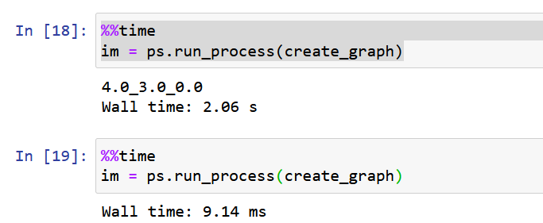

.. _TINCCaching:

3. Caching
==========

.. toctree::
   :maxdepth: 4

It is very simple to cache the output from parameter sweeps. First, enable caching::

    ps.enable_cache()

Second, you need to have the function return the data you want to cache.
In this case, we want to cache the pixels from the matplotlib plot, instead of writing
file to disk through ``savefig()``. Although a little involved, and could be done this
way::

    from matplotlib.backends.backend_agg import FigureCanvasAgg as FigureCanvas
    def create_graph(length, width, position):
        graph(length, width, position)
        canvas = FigureCanvas(gcf())
        canvas.draw()
        image = np.frombuffer(canvas.tostring_rgb(), dtype='uint8')
        f = gcf()
        plt.close()
        return image.reshape((int(f.get_figheight()*f.get_dpi()), int(f.get_figwidth()*f.get_dpi()), 3))

A simpler option could be writing the file to disk and then just reading it back, but takes up
double the disk space and would not be suitable if the data is large, as the cache would be a second
file written to disk.

The returned data from this function are the graph pixels::

    im = create_graph(1,3,0.3)
    
    import IPython.display
    import PIL.Image
    IPython.display.display(PIL.Image.fromarray(im))

You can run the sweep with::

    ps.sweep(create_graph)

You will find that if you interrupt the sweep after enabling cache, the next
time you start a sweep it will continue where the previous sweep left off.

You can get specific data from the cache thorugh the ``run_process()`` function::

    l.value = 3
    w.value = 7
    pos.value = 0.5
    im = ps.run_process(save_graph3)
    plt.axis('off')
    imshow(im)

If cache is enabled, the first time the function is executed through ``run_process()`` will produce
cache and take longer. Note that ``sweep()`` calls ``run_process()`` internally, so any cache produced
by the sweep will be available through ``run_process()``

Also note that the parameter callbacks are not called when there is cache available. In some instances,
you might want to force the parameters to actually change, you will need to add ``force_recompute=True``
when calling ``run_process()``.

You can clear the disk cache using ``clear_cache()``::

    ps.clear_cache()

Next: :ref:`TINCNotebookWidgets`
