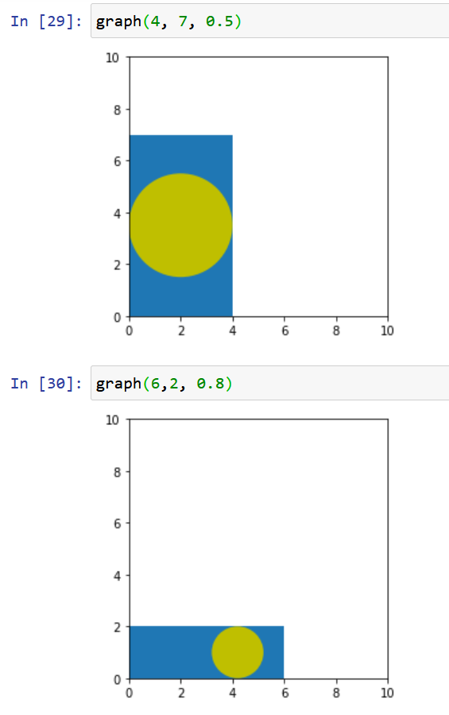
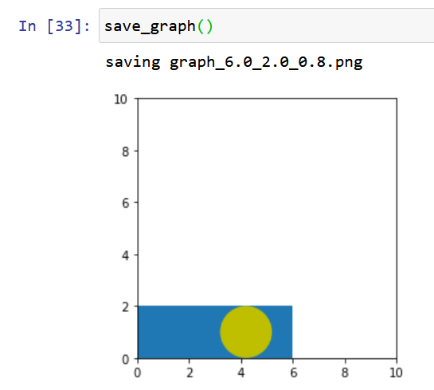
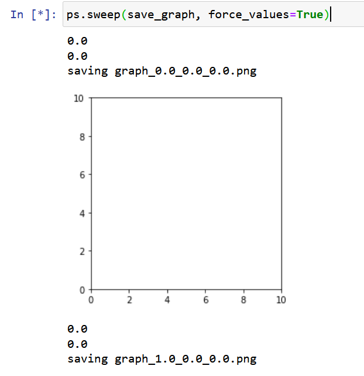

.. _TINCInteractiveDisplay:

2. Interactive computation
==========================

.. toctree::
   :maxdepth: 4

This section will show how to perform interactive computation on the jupyter notebook using TINC.

Let's imagine we need to explore how a circle can be contained within a rectangle. We need to 
find both the maximum circle that can be contained, but we also need to find an aesthetically
pleasing place to locate it within the rectangle. This tries to represent both the deterministic and quantitative aspects
of computationsl research, as well as those that are more fluid and rely on a researcher's
experience and intuition.

First we define two parameters that determine the rectangle dimensions, and a third one that
represents the location of the circle within the rectangle::

    l = Parameter("length", "dimensions")
    w = Parameter("witdh", "dimensions")
    l.values = linspace(0, 10, 11)
    w.values = linspace(0, 10, 11)

    pos = Parameter("position")
    pos.values = linspace(0, 1, 21)

The ``pos`` parameter represents the offset from the bottom/left of the rectangle at 0 to the
top-most/right-most position at 1.

A parameter space that contains these parameters can be defined::

    ps = ParameterSpace()
    ps.register_parameters([l,w,pos])

We can define a function that calculates the maximum diameter of a circle that can fit within
the rectangle::

    def max_circle(value = 0):
        m = min(l.value, w.value)
        print(m)
        return m

Notice that because the function depends on both ``l`` and ``w`` and the changed value is not 
important, we provide a default value of 0, to allow this function to be called by itself with
no arguments::

    l.value = 4
    w.value = 7
    max_circle() # Prints '4.0'

We then register the ``max_circle()`` function as a callback to both ``l`` and ``w``::

    l.register_callback(max_circle)
    w.register_callback(max_circle)

We can test this with::

    w.value = 5
    l.interactive_widget() 

When you move the slider, you will see that the printed value is 5 for l >= 5 and is equal
to l for the rest of the values.

We now write code to graph the output::

    import matplotlib.pyplot as plt
    def graph(length, width, pos):    
        plt.axes()
        
        # Draw rectangle
        points = [[0, 0], [length, 0], [length, width], [0, width], [0,0]]
        polygon = plt.Polygon(points)
        plt.gca().add_patch(polygon)

        # Draw circle
        diameter = max_circle()
        
        center = (diameter* 0.5 + (pos *(length - diameter)), diameter* 0.5 + (pos *(width - diameter)))
        
        circle = plt.Circle(center, radius=diameter* 0.5, fc='y')
        plt.gca().add_patch(circle)
        plt.axis('scaled')
        plt.xlim(0, 10)
        plt.ylim(0, 10)

We can test the graph output like this:

Parameter Sweeps
----------------

We can generate all the posible graphs for all combination of values of the l,w and pos parameters
using the parameter sweep functionality of the ``ParameterSpace`` class.

We first need to define a function that will store the graph to disk with a unique name for each
sample in the parameter space::

    def save_graph():
        graph(l.value, w.value, pos.value)

        filename = f"graph_{l.value}_{w.value}_{pos.value}.png"
        print("saving " + filename)
        savefig(filename)

Running it produces an output like:

We can then perform the parameter sweep to compute all the possible graphs::

    ps.sweep(save_graph, force_values=True)

The output is a long list like this:

Let's clean it up!

We can see the values printed from the parameter callback. We can get rid
of these by removing the callbacks::

    l.remove_callback(max_circle)
    w.remove_callback(max_circle)

Additionally we can avoid showing the graph by calling ``plt.close()`` after ``savefig()``.

The ``force_values=True`` argument above is needed because we are reading the parameter
values within functions called by the sweep, when we pass them to the ``graph()``
function and when we construct the filename. There is another method of reading the
current parameter values when doing a parameter sweep that involves using the
parameter names as parameters to the function::

    def save_graph2(length, width, position):
        graph(length, width, position)

        filename = f"graph_{length}_{width}_{position}.png"
        print("saving " + filename)
        savefig(filename)

The name of the parameter to the function must match the parameter's *tinc_id*.
This is generally the prefered mechanism, as the processing function is decoupled from the 
parameters, which makes the function more reusable. The parameter sweep can then 
be done like this::

    ps.sweep(save_graph2)

It's likely you might need to 'stop' the sweep if you interrupted it::

    ps.stop_sweep()

Next: :ref:`TINCCaching`
