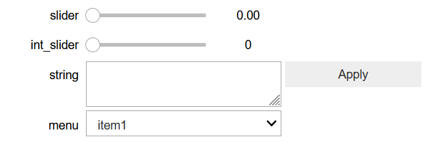
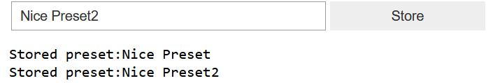
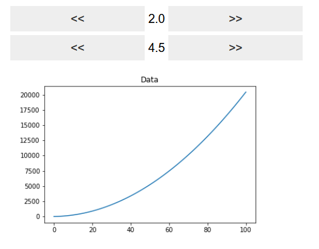

.. _TINCNotebookWidgets:

4. Notebook Widgets
===================

.. toctree::
   :maxdepth: 4

Most TINC objects provide simple creation of widgets for jupyter notebook through
the `ipywidgets <https://ipywidgets.readthedocs.io/en/stable/>`_ module.
You must install ``ipywidgets`` for these features to be available.

As described in previous tutorials, all Parameter classes provide widgets through the
``interactive_widget()`` function. But this by itself can only provide a single control
at a time. You can use 
`ipywidget layouts <https://ipywidgets.readthedocs.io/en/stable/examples/Widget%20List.html#Container/Layout-widgets>`_ 
to group widgets and create more complex interfaces::

    p = Parameter("slider", minimum=0, maximum=3)
    i = ParameterInt("int_slider")
    s = ParameterString("string")
    c = ParameterChoice("menu")

    c.set_elements(("item1", "item2", "item3"))

    from ipywidgets import VBox

    VBox([p.interactive_widget(),i.interactive_widget(),s.interactive_widget(), c.interactive_widget()])

Produces:

You can have a special GUI that can move through discrete parameter spaces, when the ``values`` property
for the parameter has been set::

    p.values = linspace(0, 30, 21)
    p.interactive_control()
    

The values for all widgets representing the same parameter will synchronize, so if you use the button
interface or the slider control, the value will be reflected in the other. Any change in the widget
will trigger callbacks registereed with the parameter.

You can have a GUI for the preset handler too::

    presets = PresetHandler()
    presets.register_parameter(p)
    presets.register_parameter(i)
    presets.interactive_widget()

This creates a dropdown menu with the list of available presets. When a preset is selected from the
list, the values for parameters will be updated.

You can easily create custom interfaces, for example to allow naming presets before storing them::

    from ipywidgets import HBox, Text, Button
    text_widget = Text("preset_name")
    button = Button(description="Store")

    def store_preset(state):
        presets.store_preset(text_widget.value)
        print("Stored preset:" + text_widget.value)

    button.on_click(store_preset)
    HBox([text_widget, button])

Dynamic Graph Updates
---------------------

You can use parameter widgets to update matplotlib graphs. Matplotlib does not provide a mechanism
to set the plot data that updates plots in the jupyter notebook, so we need to have matplotlib
generate an image, and the interactive updates are handled by TINC that sets the new image.
This interactive image update can be done using the :class:`tinc.disk_buffer.DiskBufferImage` class.
Disk buffers in TINC are files on disk that can trigger updates whenever they change. The 
``DiskBufferImage`` class holds an image and provides an ``interactive_widget()`` that displays the
image and updates whenever the disk buffer is changed.

To create a disk buffer::
    
    imageBuffer = DiskBufferImage("graph" , "graph.png", "cache")

This will create a disk buffer with *tinc_id* "graph" that will write and read from a file called "graph.png"
in the "cache" directory.

We then write a function that will be called whenever a parameter changes that updates the content of the
disk buffer::

    def update_graph(ignored_value = 0):
        x = linspace(0, 100, 101)
        line = p.value * x * x + p2.value * x
        fname = imageBuffer.get_filename_for_writing()
        f = plt.figure()
        plt.title("Data")
        plt.plot(x, line)
        plt.savefig(fname)
        plt.close()
        imageBuffer.load_data(fname)

Notice how we first request the filename from the ``DiskBufferImage`` object, write to it and then call
``load_data()`` to notify that we are done writing.
Next, we register this function as callback to parameters and we draw the control interface::
    p.register_callback(update_graph)
    p2.register_callback(update_graph)

    VBox([p.interactive_control(), p2.interactive_control(), imageBuffer.interactive_widget()])

Plotly
^^^^^^

You can do something similar with plotly. Because plotly provides an interface to set the plot data,
the process is much simpler::

    import plotly.graph_objects as go
    x = linspace(0, 100, 101)
    y = linspace(0,100, 101)
    g = go.FigureWidget(data=[go.Scatter(x = x, y =y )])

    def update_graph(ignored_value = 0):
        global g
        line = p.value * x * x + p2.value * x *50
        g.data[0].y = line

    p.register_callback(update_graph)
    p2.register_callback(update_graph)

    VBox([p.interactive_control(), p2.interactive_control(), g])

Other plotting libraries can be handled in a similar way. 

Next: :ref:`TINCDataPool`