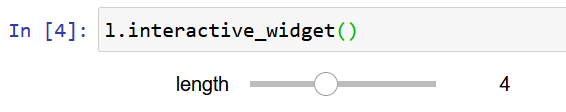

.. _TINCPythonTutorial:

1. Modeling the parameter space
===============================

.. toctree::
   :maxdepth: 4

At the core of TINC are two classes, the :class:`tinc.parameter.Parameter` and the
:class:`tinc.parameter_space.ParameterSpace`. Although they belong to the ``parameter``
and ``paramter_space`` modules, they are brought into the root with ``from tinc import *``,
so you can use ``Parameter`` and ``ParameterSpace`` directly.

Parameters
----------

A ``Parameter`` defines a dimension in a parameter space and is identified by a name (called *tinc_id*)
and optionally by a group that it belongs to::

    l = Parameter("length", "dimensions")
    h = Parameter("height", "dimensions")

You can set a minimum and maximum value for a parameter by setting the minimum and maximum
properties::

    l.minimum = 0
    l.maximum = 10

or define the range in the constructor::

    h = Parameter("height", "dimensions", minimum=0, maximum=10)

Parameter Values
^^^^^^^^^^^^^^^^

A TINC parameter defines the constraints and data type for a data dimension. The parameter also has a "current" value
that can be set and queried through the ``value`` member::

    l.value = 3.5
    print(l.value)
    l.value = 11
    print(l.value) # Value will be 10, as values are clamped according to minimum and maximum

The parameter can be set to use a discrete space of possible values it can take. These values can be set through
the ``values`` property::

    l.values = linspace(0,10, 11);
    print(l.values) # array([ 0.,  1.,  2.,  3.,  4.,  5.,  6.,  7.,  8.,  9., 10.])

Whenever the value for a parameter is set, it will be rounded to the closest value in the list of values::

    l.value = 3.3
    print(l.value) # 3
    l.value = 3.9
    print(l.value) # 4

Parameter callbacks
^^^^^^^^^^^^^^^^^^^

A parameter can be made to trigger computation whenever its value changes. This can be done
by registering a function as a callback. The function must take a single argument which will
be the new parameter value::

    def on_change(new_value):
        print(new_value)

    l.register_callback(on_change)

In this case, whenever the value changes, it will be printed out::

    l.value = 4.1 # Prints the value '4'

The callback function will be called whenever the value changes either from setting it directly
through the ``value`` member, when it is changed through a Preset, through a GUI or when it is
set remotely if the parameter is registered to a TincClient or TincServer. The callback function
can be made to trigger computation using regular python facilities like produce data on disk or
render a graph, and it can used to interactively change displayed graphs on a jupyter notebook or 
a remote client/server through the DiskBuffer classes.

Data Types
^^^^^^^^^^

The parameter can be made to store specific types of data. This will require using specific classes
that inherit from the ``Parameter`` class. For example, :class:`tinc.parameter.ParameterInt` holds
32-bit signed integers, :class:`tinc.parameter.ParameterBool` holds a ``True`` or ``False`` value,
and :class:`tinc.parameter.ParameterString` can hold strings. Apart from these basic types, TINC
provides convenience parameters that can hold composite data types like 
:class:`tinc.parameter.ParameterColor` for RGBA data and :class:`tinc.parameter.ParameterVec` for
fixed size vectors (e.g. Vec3 for xyz coordinates). There are also :class:`tinc.parameter.Trigger` and
:class:`tinc.parameter.ParameterChoice` that don't offer specific functionality, but determine
the behavior of the parameter when a graphical control for it is displayed.

Jupyter widgets
^^^^^^^^^^^^^^^

All TINC parameters are built to easily create jupyter widgets through the ``ipywidgets`` library.
If this library is present and you are running the code in a jupyet notebook, you can create widgets
in the notebook by invoking the *interactive_widget()* method:

ParameterSpace
--------------

The TINC parameter space is essentially a container for parameters. You can create a parameter space
and add parameters like this::

    ps = ParameterSpace()
    ps.add_parameter(l)

File System and the parameter space
^^^^^^^^^^^^^^^^^^^^^^^^^^^^^^^^^^^

The parameter space in TINC is also designed to map each sample in the space to
specific locations in the file system. This can assist finding files where the directory structure or the
filename depends on the current parameter values.

Paths in TINC are represented by the :class:`tinc.distributed_path.DistributedPath` class. A distributed path
consist of a root path, that can be different for different nodes in a network system (for example to
reflect differences in filesystem management between different OSs), a relative path that should be appended
to the root path to construct the path and an optional file name. Using root path and file name is optional, as it can be left
empty and the full path and file name can be set in the "relative path".

For example, let's assume we have a dataset with many folders that contain data about rectangles. The data
is in a file called "data.json" within one of many directories named according to the rectangle's
characteristics, e.g. ``/data/w1_h3``, ``/data/w2_h4`` , etc.

You can use the parameter space class to help navigate the filesystem through parameters.

You first need to set the *path template* like this::

    ps.set_root_path("/data/")
    ps.set_current_path_template("w%%width%%_h%%height%%")

The template will be parsed looking for ``%%`` to substitute parameter values according to the parameter's
*tinc_id*. Notice that in this case it is not the variable's name, but it's id.

Doing this will result in the following::
    
    In [8]: ps.get_current_relative_path()
    Out[8]: 'w0.0_l0.0'

This is of course not acceptable, as the values are correct, but they do not map to the correct path.
There are two options. You could switch to using ``ParameterInt`` or you can have the values of the
parameter be mapped to specific strings. This can be very useful in cases where zero padding is not
consitent. To do this, we need to set the ``ids`` member of each parameter::

    l.ids = [str(i) for i in range(11)]
    w.ids = [str(i) for i in range(11)]

To have the template resolve to ids instead of values, append ``:ID`` to the parameter id in the
substitution string:

    In [10]: l.value = 4
    ...      w.value = 3
    ...      ps.set_current_path_template("w%%width:ID%%_l%%length:ID%%")
    ...      ps.get_current_relative_path()
    Out[10]: 'w3_l4'

You can also use ``:INDEX`` to substitute the index of the current value in the list of possible values.

Presets
=======

A preset is a snapshot of parameter values. You can use the :class:`tinc.preset_handler.PresetHandler`
class to store and recall presets. You must register all parameters you want to keep in the snapshot
with the preset handler::

    presets = PresetHandler()
    presets.register_parameter(l)
    presets.register_parameter(w)

The ``store_preset`` function stores the current values::

    l.value = 2
    w.value = 1
    presets.store_preset("test1")

The ``recall_preset`` function sets the parameter values to the values stored in the preset::

    l.value = 5
    w.value = 3
    presets.recall_preset("test1")
    print(l.value, w.value)

prints::
    2.0 1.0

Presets are stored in text files within the preset folder that is set to ``presets`` by default.
After storing the preset as shown above, a file called ``test1.preset`` is created that contains
the following::

    /dimensions/length f 2.0
    /dimensions/width f 1.0
    ::

You can modify and create preset text files.

Next: :ref:`TINCInteractiveDisplay`